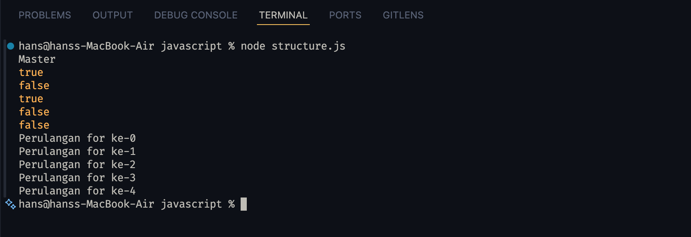
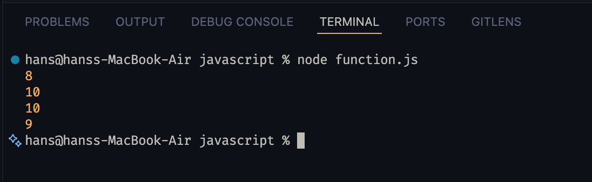
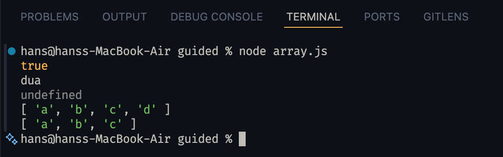
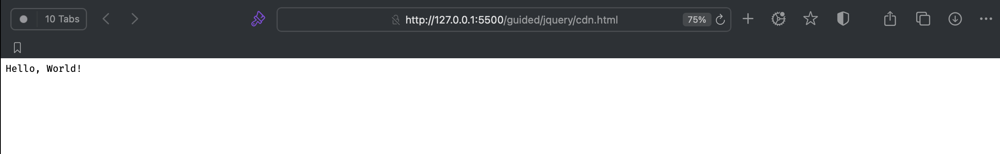
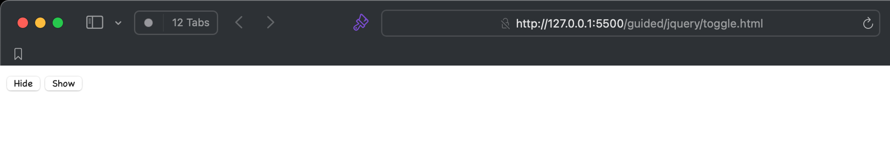
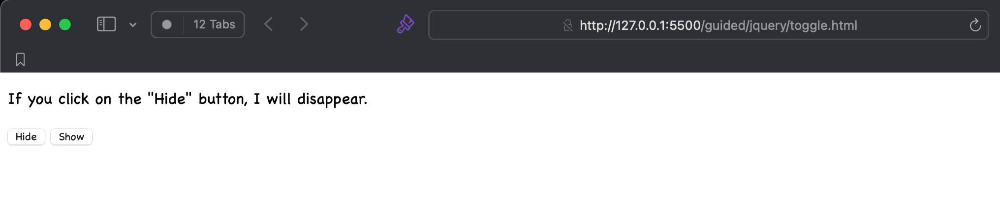
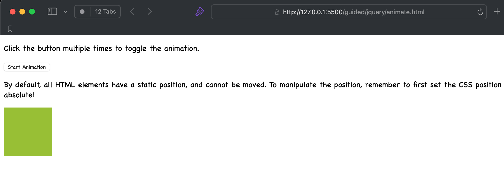
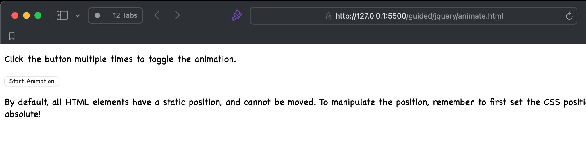
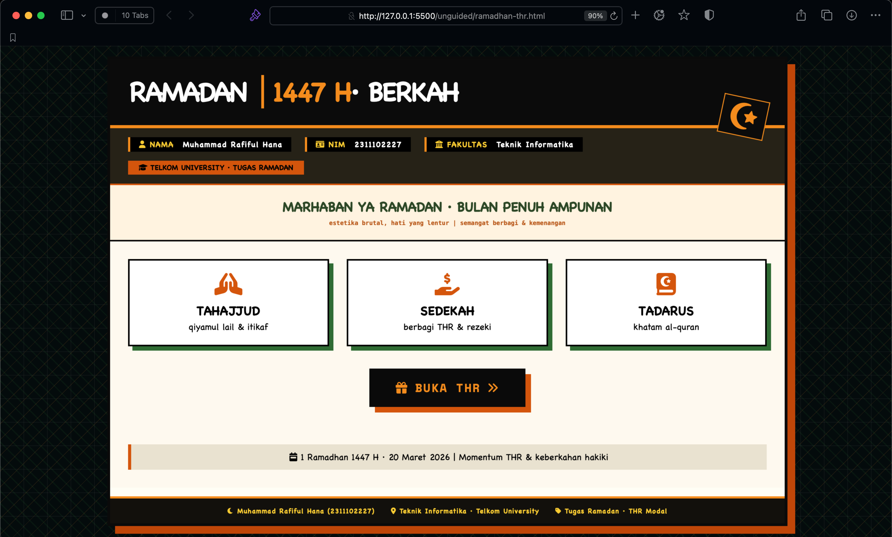
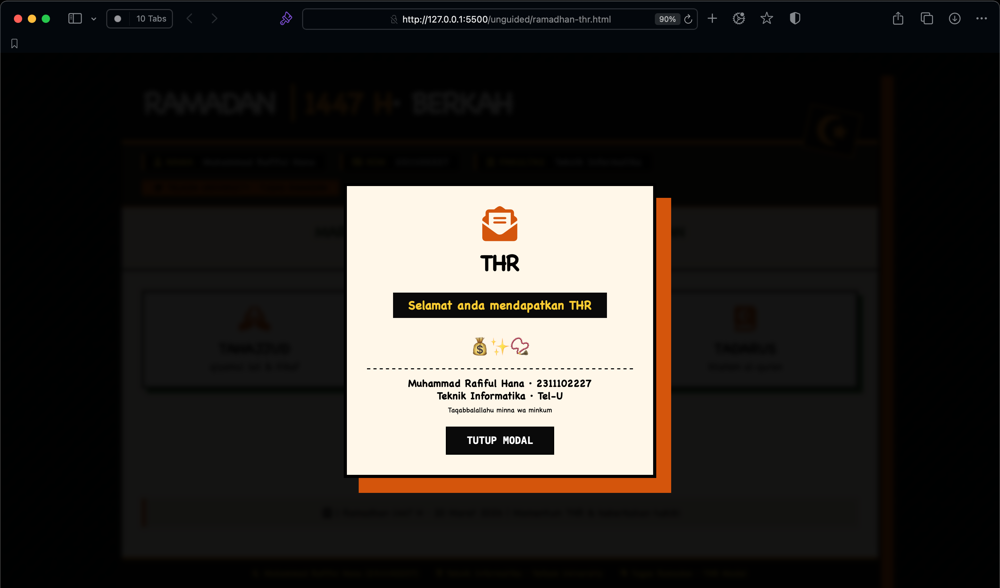

# Tugas Praktikum Aplikasi Berbasis Platform - Pertemuan 3

**Nama:** Muhammad Rafiful Hana  
**NIM:** 2311102227  
**Fakultas:** Teknik Informatika - Telkom University  

---

## Daftar Isi

1. [Deskripsi Proyek](#deskripsi-proyek)
2. [Struktur Direktori](#struktur-direktori)
3. [Guided - JavaScript Dasar](#guided---javascript-dasar)
   - [Struktur Kontrol](#struktur-kontrol)
   - [Fungsi](#fungsi)
   - [Array](#array)
4. [Guided - jQuery Dasar](#guided---jquery-dasar)
   - [Pengenalan CDN jQuery](#pengenalan-cdn-jquery)
   - [Hide/Show](#hideshow)
   - [Animasi](#animasi)
5. [Unguided - Tugas Mandiri](#unguided---tugas-mandiri)
   - [Ramadan THR Interactive](#ramadan-thr-interactive)
6. [Cara Menjalankan](#cara-menjalankan)
7. [Referensi](#referensi)

---

## Deskripsi Proyek

Proyek ini merupakan kumpulan tugas praktikum mata kuliah Aplikasi Berbasis Platform untuk **Pertemuan 3** yang berfokus pada pengenalan **JavaScript** dan **jQuery**. Proyek ini terdiri dari dua bagian utama:

- **Guided (Terbimbing):** Materi pembelajaran JavaScript dan jQuery yang mencakup struktur kontrol, fungsi, array, serta implementasi event handling dan animasi menggunakan jQuery.
- **Unguided (Mandiri):** Tugas mandiri berupa halaman interaktif bertema Ramadan dengan THR Interactive menggunakan jQuery, menerapkan konsep neurobrutalist design.

---

## Struktur Direktori

```
.
├── README.md
├── guided/
│   ├── javascript/
│   │   ├── structure.js              # Struktur kontrol & perulangan
│   │   ├── function.js               # Function declaration & expression
│   │   ├── array.js                  # Array & method push/pop
│   │   ├── output-structure.png      # Screenshot output structure.js
│   │   ├── output-function.png       # Screenshot output function.js
│   │   └── output-array.png          # Screenshot output array.js
│   └── jquery/
│       ├── cdn.html                  # Cara load jQuery via CDN
│       ├── toggle.html               # Hide/Show dengan jQuery
│       ├── animate.html              # Animasi toggle height
│       ├── output-cdn.png            # Screenshot output cdn.html
│       ├── output-toggle-hide.png    # Screenshot hide
│       ├── output-toggle-show.png    # Screenshot show
│       ├── output-animate-before.png # Screenshot sebelum animasi
│       └── output-animate-after.png  # Screenshot setelah animasi
└── unguided/
    ├── ramadhan-thr.html             # Halaman interaktif THR Ramadan
    ├── output-main.png               # Screenshot halaman utama
    └── output-popup.png              # Screenshot modal popup
```

---

## Guided - JavaScript Dasar

Bagian ini berisi tiga file JavaScript yang mempelajari konsep fundamental JavaScript.

### Struktur Kontrol

**File:** `guided/javascript/structure.js`



File ini mendemonstrasikan:

- **Percabangan if-else:** Menentukan gelar berdasarkan jenjang pendidikan (S1 = Sarjana, S2 = Master, S3 = Doktor).
- **Operator Perbandingan:** Perbedaan loose equality (`==`) dan strict equality (`===`) untuk berbagai tipe data (string, number, boolean, null, undefined).
- **Perulangan while:** Mencetak perulangan dari 1 hingga 4.
- **Perulangan do-while:** Membangkitkan angka random 0-9 hingga angka 5 ditemukan.
- **Perulangan for:** Mencetak perulangan dari 0 hingga 4.

### Fungsi

**File:** `guided/javascript/function.js`



File ini mendemonstrasikan:

- **Function Declaration:** Mendeklarasikan fungsi `tambah(a, b)` menggunakan syntax function declaration.
- **Function Expression:** Mendeklarasikan fungsi `tambah(a, b)` menggunakan function expression (variabel).
- **Nested Function Call:** Memanggil fungsi di dalam fungsi, contoh: `tambah(tambah(3, 5), 2)` menghasilkan 10.

### Array

**File:** `guided/javascript/array.js`



File ini mendemonstrasikan:

- **Array Sederhana:** Array dengan elemen string, number, dan boolean.
- **Array Multidimensi:** Array di dalam array (matrix 2x2).
- **Akses Elemen:** Mengakses elemen array berdasarkan index.
- **Method push():** Menambahkan elemen di akhir array.
- **Method pop():** Menghapus elemen terakhir dari array.

---

## Guided - jQuery Dasar

Bagian ini berisi tiga file HTML yang mempelajari penggunaan jQuery untuk manipulasi DOM dan animasi.

### Pengenalan CDN jQuery

**File:** `guided/jquery/cdn.html`



File ini mendemonstrasikan cara memuat jQuery dari CDN (Content Delivery Network) menggunakan tag `<script>`. jQuery versi 3.6.0 dari `code.jquery.com` digunakan. Saat dokumen siap (`document.ready`), akan menuliskan "Hello, World!" ke halaman.

**Konsep yang dipelajari:**
- Memuat library jQuery via CDN
- Event `document.ready()` untuk memastikan DOM telah dimuat sebelum menjalankan script

### Hide/Show

**File:** `guided/jquery/toggle.html`




File ini mendemonstrasikan event handling untuk menyembunyikan dan menampilkan elemen HTML menggunakan jQuery.

**Konsep yang dipelajari:**
- Method `hide()` untuk menyembunyikan elemen `<p>`
- Method `show()` untuk menampilkan elemen `<p>`
- Event handler `click()` pada tombol Hide dan Show
- Manipulasi DOM dengan selektor jQuery (`$("p")`)

### Animasi

**File:** `guided/jquery/animate.html`




File ini mendemonstrasikan method `animate()` jQuery untuk membuat efek toggle ketinggian elemen `div`.

**Konsep yang dipelajari:**
- Method `animate()` untuk animasi kustom
- Properti `height: 'toggle'` untuk mengganti antara show dan hide
- Event `click()` sebagai trigger animasi

---

## Unguided - Tugas Mandiri

### Ramadan THR Interactive

**File:** `unguided/ramadhan-thr.html`

**Tampilan Halaman Utama:**



**Tampilan Modal Popup:**



Halaman ini merupakan tugas mandiri berupa halaman interaktif bertema **Ramadan 1447 H** dengan desain neurobrutalist. Halaman ini menggunakan jQuery untuk interaktivitas dan menampilkan konsep THR (Tunjangan Hari Raya) secara visual.

**Fitur:**
- **Header Ramadan:** Menampilkan judul "RAMADAN 1447 H BERKAH" dengan ikon bulan sabit neurobrutalist
- **Identity Row:** Menampilkan nama, NIM, dan fakultas dengan tag berwarna
- **Banner Ucapan:** "MARHABAN YA RAMADAN" dengan estetika brutalist
- **Virtue Grid:** Tiga kartu keutamaan Ramadan (Tahajjud, Sedekah, Tadarus) dengan ikon Font Awesome
- **Tombol THR Interaktif:** Tombol "BUKA THR" dengan efek hover neurobrutalist (shadow oranye, translasi)
- **Modal Popup:** Jendela modal yang muncul saat tombol THR diklik, menampilkan ucapan "Selamat anda mendapatkan THR" dengan desain neurobrutalist
- **Toast Notification:** Notifikasi sementara setelah THR diklaim
- **Footer:** Informasi identitas mahasiswa dan universitas
- **Fitur Tambahan:** Modal dapat ditutup dengan tombol Tutup, klik di luar modal, atau tekan tombol Escape

**Teknologi:**
- HTML5
- CSS3 dengan desain neurobrutalist (shadow tebal, border hitam tegas, warna kontras)
- **jQuery 3.7.1** (CDN) untuk interaktivitas
- **Font Awesome 6** (CDN) untuk ikon
- **Google Fonts** (Space Mono & Inter)

---

## Cara Menjalankan

File-file dalam proyek ini bersifat statis (client-side) dan tidak memerlukan server backend.

### Menjalankan File JavaScript

File JavaScript (`.js`) dijalankan menggunakan **Node.js**:

```bash
# Menjalankan structure.js
node guided/javascript/structure.js

# Menjalankan function.js
node guided/javascript/function.js

# Menjalankan array.js
node guided/javascript/array.js
```

### Menjalankan File HTML

#### Opsi 1 - Buka Langsung di Browser

1. Buka folder proyek di file manager.
2. Klik dua kali file HTML yang ingin dijalankan:
   - `guided/jquery/cdn.html`
   - `guided/jquery/toggle.html`
   - `guided/jquery/animate.html`
   - `unguided/ramadhan-thr.html`
3. Halaman akan terbuka di browser default.

#### Opsi 2 - Menggunakan Live Server (VS Code)

1. Buka proyek di Visual Studio Code.
2. Install ekstensi **Live Server** jika belum ada.
3. Klik kanan pada file HTML yang ingin dijalankan.
4. Pilih **Open with Live Server**.

### Catatan

- Pastikan koneksi internet aktif saat membuka file HTML, karena file-file tersebut menggunakan CDN (jQuery, Font Awesome, Google Fonts).
- File JavaScript (`.js`) hanya berisi logika dan tidak memiliki tampilan visual. Jalankan dengan Node.js untuk melihat output di terminal.

---

## Referensi

- [JavaScript MDN Web Docs](https://developer.mozilla.org/en-US/docs/Web/JavaScript)
- [jQuery Official Documentation](https://api.jquery.com/)
- [jQuery CDN](https://code.jquery.com/)
- [Font Awesome Icons](https://fontawesome.com/icons)
- [Google Fonts - Space Mono](https://fonts.google.com/specimen/Space+Mono)
- [Node.js](https://nodejs.org/)
- Telkom University - Program Studi S1 Informatika